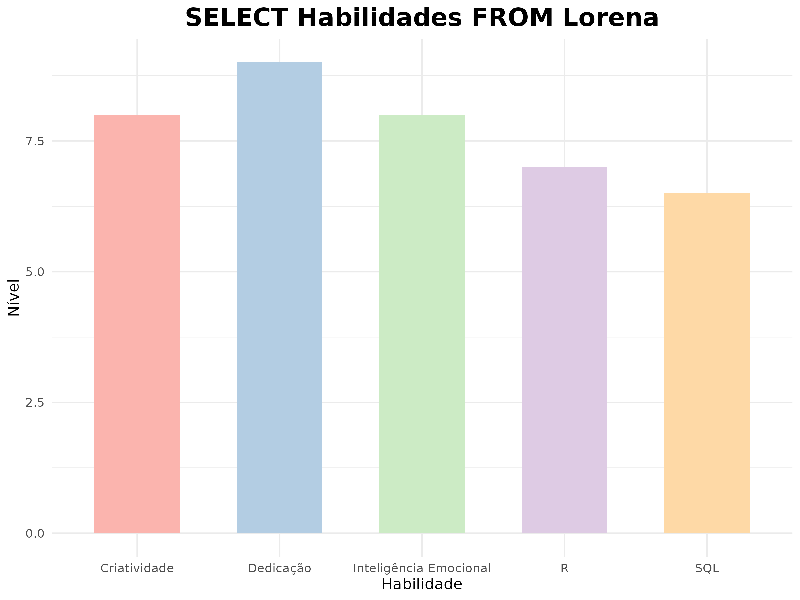
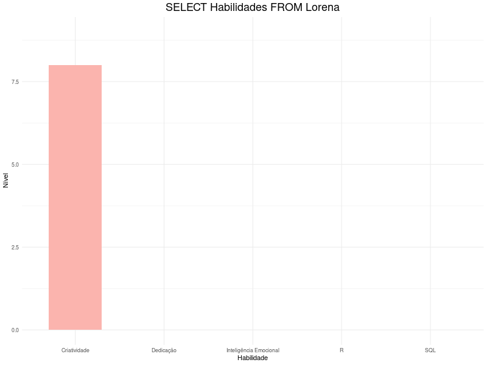

# 📊 Gráfico de Habilidades 

Este repositório contém um gráfico feito em R representando minhas habilidades.  

## 🖥️ Tecnologias utilizadas  
- R  
- ggplot2  
- plotly  

## 📷 Visualização do Gráfico  
  

## 🎞️ Animação do Gráfico  
  

## 📜 Tutorial 

- **[Tutorial Rápido e Demonstrativo](TUTORIAL.md)**: Um tutorial mais direto, mostrando o funcionamento básico do código.

## 📂 Código  
O código utilizado para gerar este gráfico pode ser encontrado no arquivo [`grafico.R`](grafico.R).  

---

Embora este gráfico seja simples, acredito que ele pode ser o ponto de partida para algo mais complexo no futuro. Com o tempo, podemos adicionar mais dados e refinar o código. O importante é começar com uma base sólida. Estudando e praticando, é possível evoluir o código para atender a novas necessidades e desafios.
 
